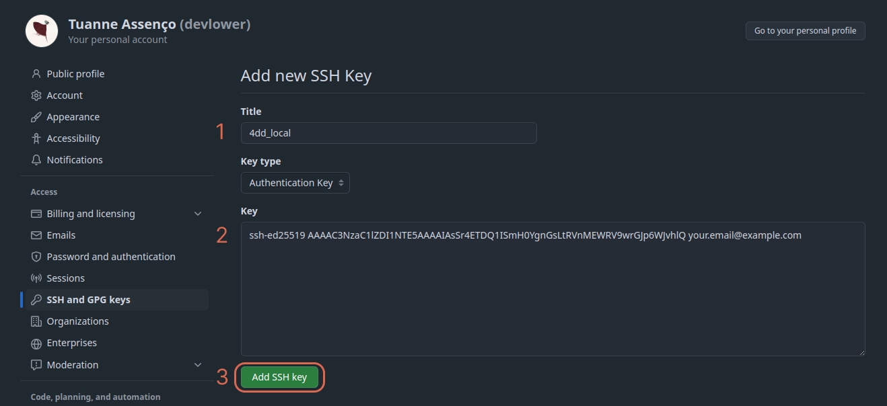
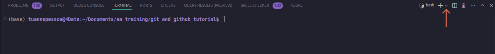

<h1 style="display: flex; justify-content: space-between;">
  <span>
  <b>Iniciando no Git & Github</b>
  </span>
  <span>
  
  </span>
</h1>

Este é um passo-a-passo dos principais conhecimentos necessários para poder utilizar o versionamento de códigos ao seu favor e da sua equipe.

## Sumário
- [1. Instalação](#1-instalação)
- [2. Criação da sua conta no Github](#2-criação-da-sua-conta-no-github)
- [3. Criação da sua autenticação de acesso SSH (Este processo é necessário apenas uma vez ou se trocar de máquina)](#3-criação-da-sua-autenticação-de-acesso-ssh-este-processo-é-necessário-apenas-uma-vez-ou-se-trocar-de-máquina)
- [4. Criando Projetos](#4-criando-projetos)
    - [4.1 Iniciando um projeto do ZERO](#41-iniciando-um-projeto-do-zero)
    - [4.2 Criando um repositório remoto no Github de um projeto já existente](#42-criando-um-repositório-remoto-no-github-de-um-projeto-já-existente)
    - [4.3 Clonando um projeto já existente no Github na sua máquina](#43-clonando-um-projeto-já-existente-no-github-na-sua-máquina)
- [5. Versionando Projetos](#5-versionando-projetos)
    - [5.1 Versionando pela interface do VS Code](#51-versionando-pela-interface-do-vs-code)
    - [5.2 Versionando pelo Terminal / Git Bash](#52-versionando-pelo-terminal--git-bash)
- [6. Criando *Branches* (Ramificações)](#6-criando-branches-ramificações)
    - [6.1 Criando *Branches* utilizando a interface gráfica do VS Code](#61-criando-branches-utilizando-a-interface-gráfica-do-vs-code)
        - [6.1.1 Alternativamente pelo Github](#611-alternativamente-pelo-github)
    - [6.2 Criando *Branches* pelo terminal](#62-criando-branches-pelo-terminal)
- [Extra. Cheat Sheet dos comandos mais comuns do Git](#extra-cheat-sheet-dos-comandos-mais-comuns-do-git)

---

## 1. Instalação
Verifique se o `git` está instalado na sua máquina:
> Bash/PowerShell
> ``` sh
> git --version
> ```

- Caso esteja, você terá um output semelhante a:

    `git version 2.43.0`
- Caso contrário, entrar em contato com o suporte para solicitação de instalação

Após verificar a instalação configure seus registros globais,se estiver no Windows será necessário abrir o Git Bash, no Linux, apenas abra o terminal

- Insira seu nome de usuário:

    > Bash/Git Bash
    >```sh
    > git config --global user.name "Your Name"
    >```

- Insira sua informação de email:
     
    > Bash/Git Bash
    >```sh
    > git config --global user.email "your.email@example.com"
    >```

--- 

## 2. Criação da sua conta no Github
1) Acesse o [Github](https://github.com/) 
2) Clique em `Sign up`

<p align="center">
  
</p>


3) Insira suas informações utilizando o email da `4DD` ex: nome.sobrenome@4datadriven.com

<p align="center">
  
</p>

4) Navegue até seu ícone no canto superior direito e clique em 'Your organizations'

<p align="center">
  
</p>

5) Selecione a organização da `4DD`

<p align="center">
  
</p>

---
## 3. Criação da sua autenticação de acesso SSH (Este processo é necessário apenas uma vez ou se trocar de máquina)
1) Verifique se na raíz da sua máquina existe o diretório `.ssh`
    - Windows: `C:\Users\usuario`

        > PowerShell
        > ```sh
        > cd ~ && dir
        > ```
    - Linux: `/home/usuario`

        > Bash
        > ```sh
        > cd ~ && ls -la
        > ```

    <p align="center">
        
    </p>

    - Caso a pasta não exista, crie e mude para o seu diretório:
        > Bash/PowerShell
        > ```sh
        > mkdir .ssh && cd .ssh
        > ```

2) Digite o comando de criação da sua chave de autenticação e troque o email de exemplo pelo seu:

    > Bash/PowerShell
    > ```sh
    > ssh-keygen -t ed25519 -C "your.email@example.com"
    > ```

    - Aperte `Enter` pelas três próximas sequências para continuar, não é necessário inserir mais nenhuma informação. Output de exemplo:

    <p align="center">
        
    </p>

    - Valide e adicione sua chave no sistema:
        > Bash/PowerShell
        > ``` sh
        > eval "$(ssh-agent -s)" && ssh-add ~/.ssh/id_ed25519
        > ```

    <p align="center">
        
    </p> 

    - Acesse o segredo da sua chave:
        > Bash/PowerShell
        > ``` sh
        > cat ~/.ssh/id_ed25519.pub
        > ```
    
    - Copie a informação gerada do comando anterior:
<p align="center">
    
</p> 

3) Acesse a sua página no [Github](https://github.com/), clique no seu ícone e em *'Settings'*:

<p align="center">
    
</p> 

4) Clique em *'SSH and GPG keys'* e em seguida em *'New SSH key'*:

<p align="center">
    
</p> 

5) Crie um título para a sua máquina, em seguida cole as informações copiadas da sua chave pública e clique em 'Add SSH key':

<p align="center">
    
</p> 

Desta maneira a sua máquina terá permissão de `clone`, `push`, `pull` para todos os projetos visiveis para seu usuário dentro da organização `4DD`.

---

## 4. Criando Projetos
Este tópico irá cobrir como inicializar um projeto no `Git` e no `Github`em diferentes contextos.

### 4.1 Iniciando um projeto do ZERO

1) Acesse a sua página do [Github](github.com), em seguida selecione a organização da `4DD`, clique em *'Repositories'* e por fim em *'New repository'*

<p align="center">
    
</p> 

2) Insira o nome do seu projeto e clique em *'Create repository'*

<p align="center">
    
</p> 

3) Copie o diretório do seu repositório remoto

<p align="center">
    
</p> 

4) Vá para o seu diretório local onde pretende armazenar seu projeto, em seguida abra o terminal (Linux) ou o Git Bash (Windows) neste diretório e clone o repositório remoto do Github

> Bash/Git Bash
> ```sh
> git clone git@github.com:4Data-Driven/nome_do_projeto.git
>```

Desta maneira você pode dar início ao seu projeto.

### 4.2 Criando um repositório remoto no Github de um projeto já existente

1) Vá até o diretório do seu projeto já existente, abra o terminal (Linux) ou o Git Bash (Windows) e inicie o versionamento do `git`

> Bash/Git Bash
>```sh
> git init
>```

2) Adicione os arquivos que serão acompanhados pelo versionamento

> Bash/Git Bash
>```sh
> git add .
>```

- O `.` aqui simboliza a captura de todos os arquivos dispostos no diretório do projeto, caso queira versionar apena um arquivo específico você pode incluí-lo unitáriamente digitando seu nome, ex: `git add nome_do_arquivo_de_interesse.py`

3) Commite a adição dos arquivos a ser versionado e adicione uma mensagem curta que descreva sobre as mudanças desenvolvidas

> Bash/Git Bash
>```sh
> git commit -m 'mensagem que descreva as alterações realizadas no código'
>```

4) Boa prática: caso já não venha como opção *default*, renomeie a sua branch para `main` ao invés de `master`

> Bash/Git Bash
>```sh
> git branch -m main
>```

5) Neste momento você já versionou o seu projeto localmente na sua máquina, agora será necessário criar o repositório remoto no Github. Siga os passos de **1** até **3** do subtópico '[Iniciando um projeto do ZERO](#a-iniciando-um-projeto-do-zero)'

6) Com o diretório do seu repositório remoto copiado, cole no seguinte comando (na raíz do diretório do seu projeto)

> Bash/Git Bash
>```sh
> git remote add origin git@github.com:4Data-Driven/nome_do_projeto.git
>```

7) Com o repositório remoto configurado, você pode 'enviar' seu projeto para o Github e verificar as mudanças na sua página de projeto do Github

>Bash/Git Bach
>```sh
> git push origin main
>

---

### 4.3 Clonando um projeto já existente no Github na sua máquina

1) Acesse a página do Github do projeto de interesse, clique em '*<> Code*', em seguida em 'SSH' e então copie o link do diretório do projeto remoto

<p align="center">
    
</p> 
    
2) Vá para o seu diretório local onde pretende armazenar este projeto, em seguida abra o terminal (Linux) ou o Git Bash (Windows) neste diretório e clone o repositório remoto do Github 

> Bash/Git Bash
>```sh
> git clone git@github.com:4Data-Driven/db_conn_az_login.git
>```

## 5. Versionando Projetos
Nesta seção será abordada duas maneiras de se versionar um projeto, a primeira utilizando exclusivamente a interface do Visual Studio Code e a outra através do terminal / Git Bash
### 5.1 Versionando pela interface do VS Code
Com seu projeto aberto no VS Code, note o ícone de '*Source Control*' no canto esquerdo

<p align="center">
    
</p> 

1. Conforme são realizadas alterações no seu projeto, elas são 'trackeadas' na seção de '*Changes*'

<p align="center">
    
</p> 

2. Finalizando as alterações que deseja, você irá 'apresentá-las' para o versionamento clicando no ícone de `+`, adicione uma mensagem descritiva acerca das alterações realizadas e em seguida clique no botão '*Commit*'. Desta maneira o seu código estará versionado **localmente**

<p align="center">
    
</p> 

3. Repare na árvore de versionamento onde o indicativo azul se refere ao seu versionamento local, enquanto que o indicativo rosa se refere ao versionamento remoto no Github

<p align="center">
    
</p> 

4. Para que o repositório remoto seja atualizado, clique em *`Sync Changes`*

<p align="center">
    
</p> 

5. Assim os dois indicativos estarão sincronizados, tanto o local quanto o remoto

<p align="center">
    
</p> 

6. Caso o desenvolvimento do projeto seja compartilhado com outros colegas, no cenário onde algum colega tenha realizado alguma alteração no código e versionado o repositório remoto, para que seu repositório local reflita e 'puxe' as mudanças realizadas, clique nos 'três pontinhos' do seu *`Source Control`* e clique na opção *`Pull`*:

<p align="center">
    
</p> 

### 5.2 Versionando pelo Terminal / Git Bash
1. Com seu projeto aberto no VS Code, faça o comando `Ctrl + J` para que abra o terminal na raíz do projeto

- **Caso esteja no Windows, será necessário um passo a mais, clique no *dropdown* para você poder selecionar o terminal do Git Bash para dar sequencia nos comandos**

<p align="center">
    
</p> 

2. Para visualizar rapidamente o estado atual do seu repositório local realize o comando:

> Bash/Git Bash
> ``` sh
> git status
> ```

Repare que o *output* te dá um relatório básico

<p align="center">
    
</p> 

3. Em seguida é necessário 'apresentar' as alterações realizadas para o versionamento, utilizando o comando

> Bash/Git Bash
> ``` sh
> git add . 
> ```
OU
> Bash/Git Bash
> ``` sh
> git add <Nome do arquivo> 
> ```

<p align="center">
    
</p> 

4. Com as mudanças adicionadas ao versionamento, crie um *commit* com uma mensagem descritiva das alterações realizadas no código

> Bash/Git Bash
> ``` sh
> git commit -m 'mensagem descritiva das mudanças realizadas'
> ```

Neste momento você está com o seu repositório **local** versionado

<p align="center">
    
</p> 

5. 'Sincronizando' o repositório local com o repositório remoto do Github:

> Bash/Git Bash
> ``` sh
> git push origin main
> ```

<p align="center">
    
</p> 

6. Caso o desenvolvimento do projeto seja compartilhado com outros colegas, no cenário onde algum colega tenha realizado alguma alteração no código e versionado o repositório remoto, para que seu repositório local reflita e 'puxe' as mudanças realizadas, utilize o comando:

> Bash/Git Bash
> ``` sh
> git pull origin main
> ```

<p align="center">
    
</p> 

---

## 6. Criando *Branches* (Ramificações)

*Branches* são ramificações independentes da linha principal de desenvolvimento (geralmente chamada de `main`). Elas permitem que você trabalhe em novas funcionalidades, correções de bugs ou experimentos de forma isolada, sem afetar o código principal do projeto.

Criar e gerenciar *branches* é uma das práticas mais poderosas do Git, pois facilita o trabalho em equipe, a organização do código e o controle de versões. Nesta seção, você aprenderá como criar, trocar, listar e excluir branches, além de entender seu papel no fluxo de trabalho Git.

### 6.1 Criando *Branches* utilizando a interface gráfica do VS Code

1. No canto inferior esquerdo encontre a sua *branch* atual, clique para que abra mais opções

<p align="center">
    
</p> 

2. Clique na opção *'Create new branch from...'*

<p align="center">
    
</p> 

3. Clique na *branch* que deseja criar uma 'cópia'

<p align="center">
    
</p> 

4. Insira o nome da sua nova *branch*, geralmente especificando qual a sua utilidade (fix, feat, refactor, etc)

<p align="center">
    
</p> 

5. Repare que agora a informação da sua *branch* no canto inferior esquerdo mudou para a nova criada

<p align="center">
    
</p> 

6. Dentro da sua nova *branch*, realize as funções e alterações que deseja, siga o processo de '*commitar*' e 'sincar' com o repositório remoto e note que o indicador laranja se refere a *branch main* que está 'atrás' da *branch* nova (indicativo em azul)

<p align="center">
    
</p> 

7. Com todas as alterações realizada e com uma versão estável desta *branch*, é possível 'mergiar' (mesclar) as alterações diretamente na *main*.

Clique nos 'três pontinhos' do *Source Control* e clique na opção *'Branch'*, depois em *'Merge'* e em seguida selecione a *branch main*

<p align="center">
    
</p> 

8. Retornando para a *main*

<p align="center">
    
</p> 

9. Note que no *Source Control Graph* as mudanças foram 'mergiadas' na *main*

<p align="center">
    
</p> 

10. Limpando as *branches* não utilizadas. Após as alterações realizadas e 'mergiadas', exclua a *branch*. Clique nos 'três pontinhos' do *Source Control*, opção *'Branch'*, em seguida *'Delete'* e então selecione o nome da *branch* a ser excluída. 

OBS: É necessário estar em outra *branch* para realizar este processo, idealmente na *main*

<p align="center">
    
</p> 

#### 6.1.1 Alternativamente pelo Github

11. Após criar uma nova *branch* pelo VS Code, e realizar *commits* e *pushes* para o repositório remoto do Github, aparecerá na página do seu projeto uma mensagem indicando que alterações foram realizadas e uma opção de comparar e realizar um *pull request* (PR). Clique na opção indicada

<p align="center">
    
</p> 

12. Aqui você pode incluir uma mensagem descritiva de solicitação de mescla com a *main*. Em seguida crie o seu PR

<p align="center">
    
</p> 

13. Em seguida será verificado se a sua mescla com a *main* não existe nenhum conflito com o código já existente por lá. Se esta verificação retornar com sucesso, habilitará uma opção de *merge pull request*, clique para prosseguir

<p align="center">
    
</p> 

14. Descreva os pareceres do *merge*, indicando (se houver) informações adicionais e então confirme para finalizar

<p align="center">
    
</p> 

15. Após este processo, para ser refletido no seu repositório local é necessário sincronizá-lo com o remoto. No VS Code clicar nos 'três pontinhos' em *Source Control* e selecionar a opção *'Pull'*.

Alternativamente, clique nas setinhas 'em ciclo' na sua *branch* no canto inferior esquerdo

<p align="center">
    
</p> 

### 6.2 Criando *Branches* pelo terminal

1. Cria uma nova *branch* com o comando

> Bash/Git Bash
> ``` sh
> git branch <nome da sua branch>
> ```

2. Utilize o comando a seguir para visualizar as opções de *branches* dispostas, a que está referenciada com um `*`, simboliza a branch em que está atualmente

> Bash/Git Bash
> ``` sh
> git branch
> ```

<p align="center">
    
</p> 

4. Para alternar entre *branches* utilize o `switch` ou o `checkout`

> Bash/Git Bash
> ``` sh
> git switch <nome da sua branch>
> ```

<p align="center">
    
</p> 

5. Siga normalmente com suas modificações e realize os versionamentos. Note que quando você quiser dar *push* para o repositório remoto, é necessário inserir o nome da sua nova *branch*

> Bash/Git Bash
> ``` sh
> git push origin <nome da sua branch>
> ```

<p align="center">
    
</p> 

6. Para realizar o *merge*, volte para a *main* e em seguida execute o comando de *merge* indicando de qual *branch* o *merge* virá.

> Bash/Git Bash
> ``` sh
> git merge <nome da sua branch>
> ```

<p align="center">
    
</p> 

7. Finalize limpando a *branches* que não serão mais utilizadas

> Excluindo a *branch* **local**
>
> Bash/Git Bash
> ``` sh
> git branch -d <nome da sua branch>
>

<p align="center">
    
</p> 

> Excluindo a *branch* **remota**
>
> Bash/Git Bash
> ``` sh
> git push origin --delete <nome da sua branch>
>

<p align="center">
    
</p> 

---

## Extra. *Cheat Sheet* dos comandos mais comuns do Git

| Comando                        | Descrição                                                                |
|--------------------------------|--------------------------------------------------------------------------|
| `git init`                     | Inicializa um novo repositório Git local                                 |
| `git clone <url>`              | Clona um repositório remoto para o seu computador                        |
| `git status`                   | Mostra o estado atual do repositório (arquivos modificados, staged etc.) |
| `git add <arquivo>`            | Adiciona um arquivo à área de staging                                    |
| `git add .`                    | Adiciona todas as alterações à área de staging                           |
| `git commit -m "mensagem"`     | Salva as mudanças com uma mensagem descritiva                            |
| `git push`                     | Envia os commits locais para o repositório remoto                        |
| `git pull`                     | Baixa as mudanças do repositório remoto e atualiza o local               |
| `git fetch`                    | Baixa atualizações do remoto, mas não faz merge                          |
| `git merge <branch>`           | 'Mergeia' a branch especificada na branch atual                          |
| `git branch`                   | Lista as branches locais                                                 |
| `git branch <nome>`            | Cria uma nova branch com o nome especificado                             |
| `git checkout <branch>` OU `git switch <branch>`        | Troca para a branch especificada                |
| `git checkout -b <branch>`     | Cria e já troca para a nova branch                                       |
| `git log`                      | Mostra o histórico de commits                                            |
| `git diff`                     | Mostra as diferenças entre arquivos modificados                          |
| `git reset --hard`             | Desfaz todas as mudanças locais e retorna ao último commit               |
| `git revert <hash>`            | Cria um novo commit que desfaz um commit anterior                        |
| `git stash`                    | Salva temporariamente alterações não commitadas                          |
| `git stash pop`                | Restaura alterações salvas com `stash`                                   |
| `git remote -v`                | Lista os repositórios remotos configurados                               |
| `git push origin --delete <branch>` | Exclui uma branch do repositório remoto                             |
| `git branch -d <branch>`       | Deleta uma branch local (se já foi 'mergiada')                           |
| `git branch -D <branch>`       | Força a exclusão de uma branch local, mesmo sem merge                    |

## Próximos passos

Este é apenas um tutorial simples acerca do uso e funcionamento do Git e Github, para um maior entendimento e estudo aprofundado acesse a [documentação oficial do Git](https://git-scm.com/doc).
